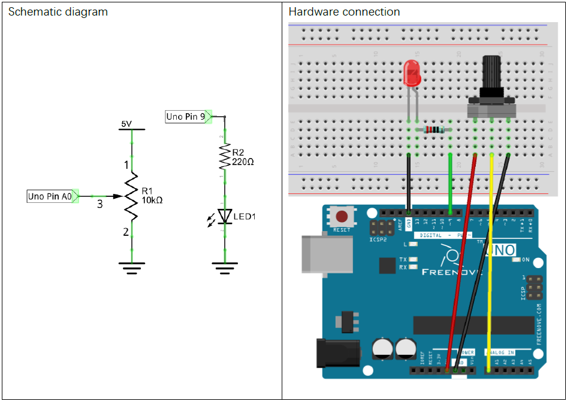

# MMM-Live-Stream-TV
A [MagicMirror²](https://github.com/MichMich/MagicMirror) Module (MMM) for displaying HLS live feeds on your mirror

...BUT WAIT!! Theres more!

Now with Arduino powered channel changing! Clone this repo today and get two arduino sketches for changing the channel with either a potentiometer OR a 10 switch rotary encoder!


Example of the Slideshow function, set to 6 second channel changes 


Example of the TV functionality with 10 switch rotary encoder!)

**these feeds are from EarthCam.com and ONLY to be used for personal art projects like the Magic Mirror*

## Installation

In your terminal, from the root of the MagicMirror project:

```bash
cd modules
```
Clone this repository:
```bash
git clone https://github.com/mcintyrehh/MMM-Live-Stream-TV.git
```

Install the `python-shell` library:
```bash
cd MMM-Live-Stream-TV
npm install
```

Configure the module in your config.js file.

## Using the module

To use this module, add it to the modules array in your config.js file.

```js
modules: [
   {
      module: 'MMM-Live-Stream-TV',
      position: 'bottom_center',
      config: {
        portname: "/dev/ttyACM0",
        style: "tv",  // Options: tv, slideshow, static
        sensors: [
          {
            name: "Potentiometer",
            description: "Potentiometer Value",
          }
        ]
      },
   }
]
```

## Configuration Options

Option|Description|Value|Default
------|-----------|-----|-------
`style`|**REQUIRED**</br> Which display method you want<br/>**Options:** `"tv", "slideshow", "static"`|string|`"slideshow"`
`frameWidth`|Width of the video frame, in pixels|number|`600`
`slideshowInterval`|Interval before switching to the next live feed|number|`15*60*1000 // 15 minutes`
`portname`|*REQUIRED for `tv`* The name/location of the port your Arduino is connected to <br/>**Options:** `Windows will be COM#, RasPi will be something like /dev/ttyACM0`|string|`"/dev/ttyACM0"`|
`sensors`|*REQUIRED for `tv`* Array of sensors from your Arduino sketch, right now its only for the potentiometer, but this allows for expansion down the road <br/> **Example: ** <code> sensors: [{name: "Potentiometer"}]</code> |array|`[{name: "Potentiometer"}]`
  
## Setting up the Arduino

Plug in your arduino and figure out what port it is connected to with the following command:

```bash
ls ~/dev/tty*
```

The serial port should be '/dev/ttyACM0', but it could have a different name.  If you aren't sure, unplug the arduino run the command again and see which one dissapears.

### Schematic Diagram/Hardware Connection



The LED is only there as an easy way to let you know the potentiometer is working, just take out the resister/LED/data/power wire and comment out the astrix'd (`**`) lines in the arduino sketch

```c++
void loop() {
  // value of the potentiometer from 0->1023
  adcValue = analogRead(A0);
  // sets a new channel variable, we will use this to check to see if it is different than the current channel
  // maps the value received from the potentiometer from 0->1023 to the 10 channels (could be 0, 9 but mapping to 10 gives a little more room for the last channel)
  int newChannel = map(adcValue, 0, 1023, 0, 10);
  // map analog value to the 0-255 range, works as PWM duty cycle of ledPin port
  analogWrite(ledPin, map(adcValue, 0, 1023, 0, 255));  // **Comment out to remove LED
  if (newChannel != currentChannel) {
    // If the channel is indeed new, send the result to computer through serial (formatted for ArduinoPort)
    Serial.print("[sensor:Potentiometer:");
    Serial.print(map(adcValue, 0, 1023, 0, 10));
    Serial.println("]");
    currentChannel = newChannel;   // saves the new channel state
  };
}
```
The name in `Serial.print("[sensor:Potentiometer:");` needs to be the same as in your config "Sensors" name

## Special Thanks


- [Furkan 'Dentrax' Türkal](https://github.com/Dentrax/MMM-ArduPort) for the amazing inspiration and Arduino->JS python scripts, without which this project would not have been possible!

## License

### The MIT License (MIT)

Copyright © 2019 Henry McIntyre

Permission is hereby granted, free of charge, to any person
obtaining a copy of this software and associated documentation
files (the “Software”), to deal in the Software without
restriction, including without limitation the rights to use,
copy, modify, merge, publish, distribute, sublicense, and/or sell
copies of the Software, and to permit persons to whom the
Software is furnished to do so, subject to the following
conditions:

The above copyright notice and this permission notice shall be
included in all copies or substantial portions of the Software.

**The software is provided “as is”, without warranty of any kind, express or implied, including but not limited to the warranties of merchantability, fitness for a particular purpose and noninfringement. In no event shall the authors or copyright holders be liable for any claim, damages or other liability, whether in an action of contract, tort or otherwise, arising from, out of or in connection with the software or the use or other dealings in the software.**
