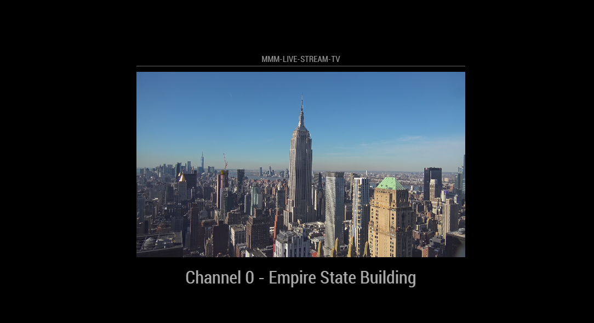
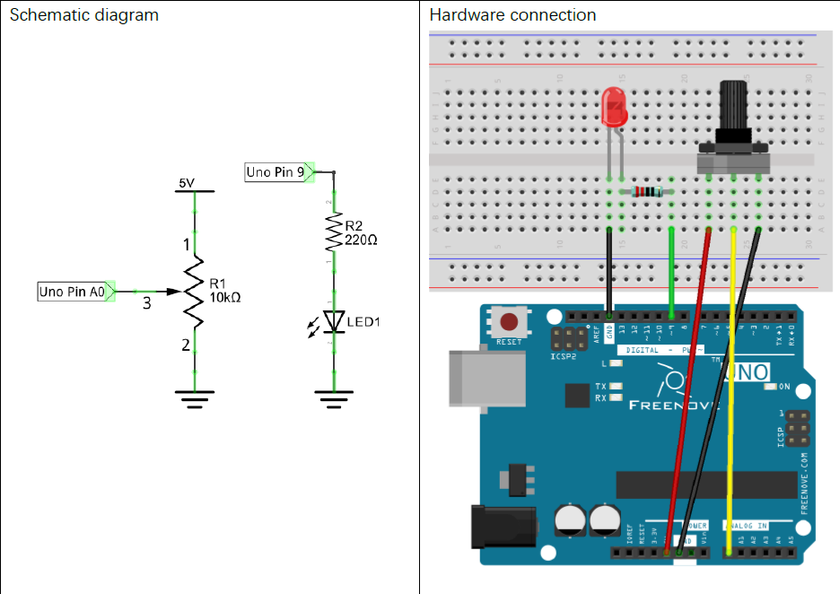

# MMM-Live-Stream-TV
MagicMirror² Module (MMM) for displaying HLS live feeds on your mirror

...BUT WAIT!! Theres more!

Now with Arduino powered channel changing! Clone this repo today and get two arduino sketches for changing the channel with either a potentiometer OR a 10 switch rotary encoder!


## Installation

In your terminal, go to your MagicMirror's Module folder:

```bash
cd ~/MagicMirror/modules
```
Clone this repository:
```bash
git clone https://github.com/mcintyrehh/MMM-Live-Stream-TV.git
```
Configure the module in your config.js file.

## Using the module

To use this module, add it to the modules array in your config.js file.

```js
modules: [
   {
      module: 'MMM-Live-Stream-TV',
      position: 'bottom_center',
      config: {
        portname: "/dev/ttyACM0",
        style: "tv",  // Options: tv, slideshow, static
        sensors: [
          {
            name: "PTNM",
            description: "Potentiometer Value",
          }
        ]
      },
   }
]
```

## Configuration Options

Option|Description
------|-----------
`portname`|The name/location of the port your Arduino is connected to<br/>**Expected Value type:** `Windows will be COM#, RasPi will be something like /dev/ttyACM#`
`style`|Which display method you want<br/>**Expected Value type:** `"tv", "slideshow", "static"`

## Setting up the Arduino

Plug in your arduino and figure out what port it is connected to with the following command:

```bash
ls ~/dev/tty*
```

The serial port should be '/dev/ttyACM0', but it could have a different name.  If you aren't sure, unplug the arduino run the command again and see which one dissapears.

### Schematic Diagram/Hardware Connection



The LED is only there as an easy way to let you know the potentiometer is working
